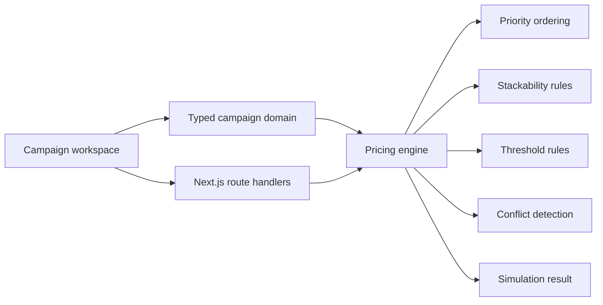

# Promotion Engine

[](https://github.com/soufianeelseflo/promotion-engine/actions/workflows/ci.yml)


**An e-commerce pricing and promotion control plane for campaign precedence, stackability, cart simulation and pre-publish conflict detection.**

Discount-code forms are easy. Operating several overlapping promotions without accidentally destroying margin is not. Promotion Engine is a public engineering case study focused on the business rules and tooling a merchandising team needs before pricing logic reaches checkout.

> **Scope note:** campaigns and cart data are fictional and seeded for public review. The repository demonstrates the rule engine, product surfaces and API boundaries; it is not presented as client work or production revenue.

## Review path

| Surface | What it demonstrates |
| --- | --- |
| `/` | Campaign KPIs, registry and conflict visibility |
| `/builder` | Rule authoring / explicit campaign configuration |
| `/operations` | Pricing simulation and operational review |
| `/insights` | Attribution and redemption visibility |
| `/api/campaigns` | Campaign API boundary |
| `/api/simulate` | Cart/pricing simulation endpoint |
| `/api/metrics` | Campaign metrics endpoint |

## Architecture



The important boundary is the **pricing engine**. UI code configures and visualizes campaign behavior; the domain engine determines what can apply, in which order, and where rules conflict.

## What this repository demonstrates

- Next.js App Router + React + strict TypeScript
- Campaign registry with status, attribution and redemption KPIs
- Explicit priority / precedence handling
- Stackable vs non-stackable promotion behavior
- Minimum-spend rules
- Free-shipping behavior
- Cart simulation before publication
- Conflict detection across concurrent campaigns
- Typed JSON APIs for campaigns, simulation and metrics
- Responsive merchandising/operations UI
- CI for typecheck + production build

## Engineering decisions

### Pricing logic is not UI state

The core promotion behavior lives in `lib/engine.ts`, not inside button handlers or rendering branches. That keeps simulation and API behavior aligned with the product UI.

### Precedence is explicit

Campaign priority is modeled rather than depending on array order or accidental checkout implementation details. That makes overlapping campaigns explainable and repeatable.

### Stackability needs a deterministic rule

The engine treats stackability as a domain constraint so a merchandising operator can understand why an offer was applied or excluded.

### Simulate before publish

`/api/simulate` exists because pricing changes should be exercised against a representative cart before they affect customers. The simulation surface is part of the product, not an afterthought.

### Conflicts are surfaced before checkout

The engine identifies incompatible overlapping campaigns early, when an operator can still fix the campaign configuration rather than debugging an unexpected customer price later.

## Production integration map

| Public case-study implementation | Production replacement |
| --- | --- |
| Seeded campaigns | Merchandising DB / campaign service |
| Sample cart | Real cart / checkout pricing context |
| Local pricing engine | Shared pricing service or domain package |
| Demo campaign metrics | Analytics / warehouse / attribution source |
| Open admin routes | Authentication + RBAC |
| In-process simulation | Versioned pricing API with observability |

## Code map

```text
app/
├── page.tsx                  # merchandising overview
├── builder/                  # campaign authoring surface
├── operations/               # simulation / operational review
├── insights/                 # attribution + campaign metrics
└── api/
    ├── campaigns/            # campaign API
    ├── simulate/             # pricing simulation
    └── metrics/              # metrics endpoint
components/
├── campaign-builder.tsx      # rule authoring UI
├── campaign-table.tsx        # campaign registry
└── simulator.tsx             # cart/pricing simulation
lib/
├── data.ts                   # seeded campaign data
├── engine.ts                 # priority, stackability and pricing rules
├── metrics.ts                # campaign calculations
└── types.ts                  # shared campaign domain
```

## Run locally

```bash
npm install
npm run dev
```

Quality gates:

```bash
npm run typecheck
npm run build
```

## About this repository

This is a **public engineering case study** using fictional commerce data. The purpose is to make pricing-domain reasoning, implementation quality and operational trade-offs inspectable directly in code.

Built by **Soufiane** — React / Next.js / TypeScript product engineering, e-commerce pricing logic, APIs and operational tooling.

See [NOTICE.md](NOTICE.md) for repository-use terms.
